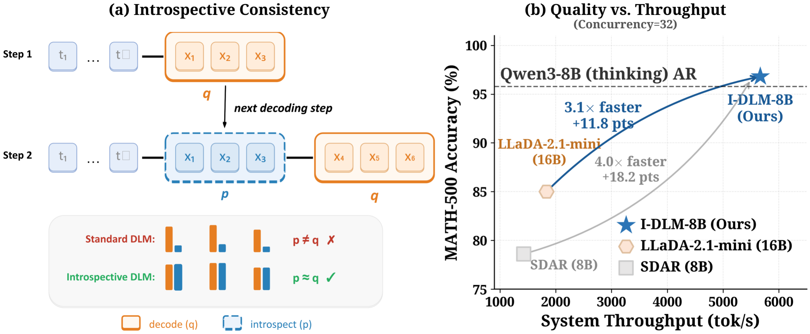

# I-DLM: Introspective Diffusion Language Models

<p align="center">
  <a href="http://introspective-diffusion.github.io/"></a>
  <a href="https://arxiv.org/abs/2604.11035"></a>
  <a href="https://huggingface.co/collections/yifanyu/introspective-diffusion-language-models-i-dlm"></a>
</p>

**The first diffusion LLM to match same-scale AR model quality across 15 benchmarks, while achieving up to 3.8x higher serving throughput at large batch sizes.**

<p align="center">
  
</p>

<details open>
  <summary><b>Demo: Quality + Speed Comparison</b></summary>

https://github.com/user-attachments/assets/5d72f3b7-468c-4087-a8f1-b551ec9622ec

  <p align="center"><i>I-DLM generates 3.8x more tokens than SDAR in the same wall-clock time while maintaining equivalent quality.</i></p>
</details>

---

## News

- **2025-04-12**: Initial code release with training and inference support.
- **2025-04-12**: Released I-DLM-8B, I-DLM-32B, and I-DLM-8B-LoRA on HuggingFace.

## Highlights

- **AR-quality diffusion LLM** — First diffusion LLM to match same-scale AR model quality across 15 benchmarks (knowledge, math, code, instruction following)
- **Introspective Strided Decoding (ISD)** — Single-pass generation + verification algorithm with p/q acceptance criterion that mathematically guarantees AR-distribution output
- **3.8x throughput over SDAR** — At concurrency=32 on a single H100, I-DLM achieves ~5,900 tok/s vs SDAR's ~1,600 tok/s
- **AR-compatible serving** — Reuses standard AR inference stacks (paged KV cache, continuous batching, CUDA graphs) via SGLang integration
- **Efficient training** — Only 4.5B tokens on 8 H100 GPUs to convert Qwen3-8B into I-DLM-8B

---

## Results

### Quality (I-DLM-8B vs baselines)

| Benchmark | I-DLM-8B | Qwen3-8B (AR) | LLaDA-2.1-mini (16B) | SDAR-8B |
|-----------|----------|----------------|----------------------|---------|
| ARC-C | 95.8 | 95.8 | 90.2 | 91.9 |
| MMLU | 82.4 | 83.5 | 74.5 | 78.6 |
| MMLU-Pro | 73.1 | 75.1 | 64.8 | 56.9 |
| GPQA-D | 55.6 | 58.9 | 46.0 | 40.2 |
| GPQA | 54.9 | 55.4 | 53.3 | - |
| GSM8K | 95.0 | 96.0 | 89.0 | 91.7 |
| MATH-500 | 96.8 | 95.8 | 85.0 | 78.6 |
| MathBench | 89.1 | 93.1 | 84.2 | 76.9 |
| AIME-24 | 69.6 | 73.1 | 43.3 | 10.0 |
| AIME-25 | 60.8 | 65.4 | 43.3 | 10.0 |
| HumanEval | 93.3 | 95.1 | 86.0 | 78.7 |
| MBPP | 92.2 | 93.4 | 82.1 | 72.0 |
| LiveCodeBench-v6 | 45.7 | 50.3 | 30.4 | 16.6 |
| IFEval | 84.7 | 84.7 | 83.2 | 61.4 |

### Serving Throughput (Single H100, SGLang)

| Concurrency | I-DLM-8B (tok/s/req) | LLaDA-2.1-mini | SDAR-8B |
|-------------|----------------------|----------------|---------|
| C=32 | 186-193 | 51-86 | 43-52 |
| C=64 | 124-125 | 28-57 | 27-28 |

---

## Model Zoo

| Model | HuggingFace | Description |
|-------|-------------|-------------|
| I-DLM-8B | [yifanyu/I-DLM-8B](https://huggingface.co/yifanyu/I-DLM-8B) | Converted from Qwen3-8B |
| I-DLM-32B | [yifanyu/I-DLM-32B](https://huggingface.co/yifanyu/I-DLM-32B) | Converted from Qwen3-32B |
| I-DLM-8B-LoRA | [yifanyu/I-DLM-8B-lora-r128](https://huggingface.co/yifanyu/I-DLM-8B-lora-r128) | LoRA adapter (rank=128) for lossless R-ISD |

## Quick Start

### Installation

```bash
git clone https://github.com/Introspective-Diffusion/I-DLM.git
cd introspective-dlm/inference
bash install.sh
```

### Launch Server

```bash
python -m sglang.launch_server \
    --model-path yifanyu/I-DLM-8B \
    --trust-remote-code --tp-size 1 --dtype bfloat16 \
    --mem-fraction-static 0.85 --max-running-requests 32 \
    --attention-backend flashinfer --dllm-algorithm IDLMBlockN \
    --dllm-algorithm-config inference/configs/idlm_blockN4_config.yaml \
    --port 30000
```

### Generate

```bash
curl http://localhost:30000/v1/chat/completions \
  -H "Content-Type: application/json" \
  -d '{
    "model": "default",
    "messages": [{"role": "user", "content": "Prove that sqrt(2) is irrational."}],
    "max_tokens": 4096,
    "temperature": 1.0
  }'
```

See [inference/README.md](inference/README.md) for detailed setup, evaluation, and benchmarking.

---

## Method

### Key Insight: Introspective Consistency

AR models inherently agree with their own generations (introspective acceptance rate ~0.98). Standard diffusion LMs with bidirectional attention lack this property (~0.57-0.70). I-DLM recovers it through:

1. **Strict causal masking** across both masked and clean tokens
2. **Logit shift** (Dream shift): hidden state at position *i* predicts token *i*+1
3. **All-masked training**: CE loss on both noisy (masked) and clean token positions

### Training

Input construction: concatenate fully-masked sequence with clean sequence `[x_t | x_0]`, apply strict causal attention uniformly, and compute CE loss on all non-padding positions.

```
L = CE_noisy + alpha * CE_clean(clean region with shifted labels)
```

See [training/README.md](training/README.md) for setup and usage.

### Inference: Introspective Strided Decoding (ISD)

Each forward pass simultaneously:
- **Generates** N new tokens from MASK positions (proposal distribution *q*)
- **Verifies** previously generated tokens now visible as clean positions (anchor distribution *p*)

Acceptance via `min(1, p(x)/q(x))` guarantees output matches the base AR distribution.

See [inference/README.md](inference/README.md) for details.

---

## Repository Structure

```
introspective-dlm/
├── training/                  # Training code and configs
│   ├── README.md
│   ├── run_train_b*-allmasked_idlm_sample.sh
│   ├── model/                 # Model configs
│   └── llama_factory_sdar/    # Modified LlamaFactory framework
├── inference/                 # Inference and serving via SGLang
│   ├── README.md
│   ├── configs/               # Algorithm config YAMLs
│   ├── eval/                  # Evaluation scripts
│   └── sglang/                # SGLang integration code
└── README.md
```

## Acknowledgments

This project builds upon:
- [LLaMA-Factory](https://github.com/hiyouga/LLaMA-Factory) for training
- [SDAR](https://github.com/JetAstra/SDAR) for model architecture
- [SGLang](https://github.com/sgl-project/sglang) for inference and serving

## Citation

```bibtex
@article{yu2026introspective,
  title={Introspective Diffusion Language Models},
  author={Yu, Yifan and Jian, Yuqing and Wang, Junxiong and Zhou, Zhongzhu
          and Zhuang, Donglin and Fang, Xinyu and Yanamandra, Sri
          and Wu, Xiaoxia and Wu, Qingyang and Song, Shuaiwen Leon
          and Dao, Tri and Athiwaratkun, Ben and Zou, James
          and Lai, Fan and Xu, Chenfeng},
  journal={arXiv preprint arXiv:2604.11035},
  year={2026}
}
```

## License

BSD 3-Clause License. See [LICENSE](LICENSE) for details.
